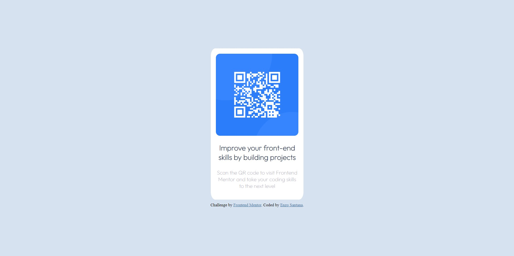

# Frontend Mentor - QR code component solution

This is a solution to the [QR code component challenge on Frontend Mentor](https://www.frontendmentor.io/challenges/qr-code-component-iux_sIO_H). Frontend Mentor challenges help you improve your coding skills by building realistic projects. 

## Table of contents

- [Overview](#overview)
  - [Screenshot](#screenshot)
  - [Links](#links)
- [My process](#my-process)
  - [Built with](#built-with)
  - [What I learned](#what-i-learned)
  - [Continued development](#continued-development)
  - [Useful resources](#useful-resources)
- [Author](#author)

## Overview

### Screenshot




### Links

- Solution URL: [QR Code Project CODE](https://github.com/AnakonStar/QR-CODE-Project)
- Live Site URL: [QR Code Project Site](https://your-live-site-url.com)

## My process

### Built with

- SASS for better style overview
- Basic HTML tags
- Basic CSS

### What I learned

The most valuable element I used in this project was responsive pages, which basically let you choose a different style for the page based on the viewport, be it Mobile or Desktop.

Like the example below:

Mobile

```css
.qr-container {
  width: 85%;
  padding: 18px;
  display: flex;
  border-radius: 5%;
  background-color: hsl(0, 0%, 100%);
  flex-direction: column;
  align-items: center;
} 
```

Desktop

```css
@mediascreen and (min-width: 375px) {
  .qr-container {
      width: 16%;
  }
} 
```

This will come in very handy next time!

### Continued development

Maybe learn more about other ways to make a website, how to use React.js, Python, PHP, which I've used, but don't go too far. Another thing will be about Clean Code, I want to study about it, and implement it in my future projects.

### Useful resources

- [Example resource 1](https://www.youtube.com/watch?v=gRIWFYRaVto) - This video from Hostinger Brasil (yes, I'm Brazilian) helps me, as I said in What I learned, to understand more about responsive pages and how to implement them.
- [Example resource 2](https://elementor.com/help/whats-the-difference-between-px-em-rem-vw-and-vh/#:~:text=VH%20is%20useful%20for%20creating,to%20viewport's%20width%20or%20height.) - This article, taught me about some differences about measurement units in CSS.

## Author

- LinkedIn - [Enzo Santana](https://www.linkedin.com/in/enzo-lima-357a27261)
- GitHub - [AnakonStar](https://github.com/AnakonStar)
- Frontend Mentor - [@AnakonStar](https://www.frontendmentor.io/profile/AnakonStar)
- Workana - [Enzo Santana](https://www.workana.com/freelancer/4c2cdd8b9e92d8b32763edc91d6cde18)
